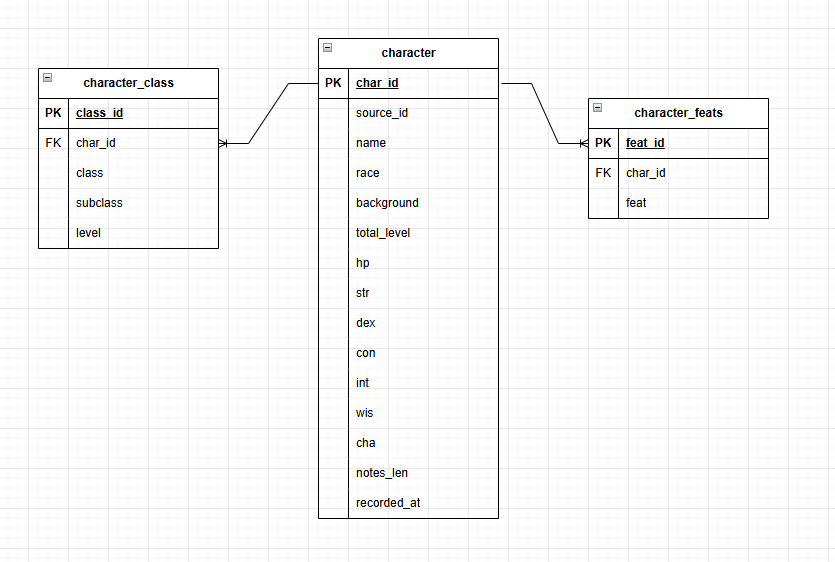

# DnD Character Analytics Project

## Project Summary
This project analyzes DnD Beyond character data using a Python ETL pipeline, PostgreSQL, and a Dash dashboard.

## Questions Answered
1. Most played class
2. Most played race
3. Number of multiclass characters
4. Number of level 20 characters
5. Most popular stat to max
6. Most popular dump stat
7. Notes length by class
8. Most popular subclass per class

## ERD

## Data Cleaning
1. Removed null or unusable values
2. Removed non-character rows (example: names containing ('s character))
3. Standardized names and stat columns

## Main Files
1. work-dir/main.py: runs ETL and loads PostgreSQL
2. sql/characters.sql: creates schema and tables
3. sql/dashboard_views.sql: creates reporting views
4. sql/analysis_questions.sql: analysis SQL
5. dashboard/app.py: Dash dashboard
6. airflow/dags/simple/characters_etl_dag.py: Airflow ETL DAG

## Setup
Create a .env file in the project root with database values: DB_HOST, DB_PORT, DB_USER, DB_PASSWORD, DB_DATABASE (and optional DB_SCHEMA).

## Run
1. Run schema SQL:
   - sql/characters.sql
   - sql/dashboard_views.sql
2. Airflow orchestration:
   - Compose file: airflow/docker-compose.yaml
   - DAG: airflow/dags/simple/characters_etl_dag.py
   - Runs both sql/characters.sql and sql/dashboard_views.sql before ETL
3. Run ETL:
   - python work-dir/main.py
4. Run dashboard:
   - python dashboard/app.py

## Tools Used
1. Python (pandas, psycopg, SQLAlchemy, Dynaconf)
2. PostgreSQL
3. Dash/Plotly